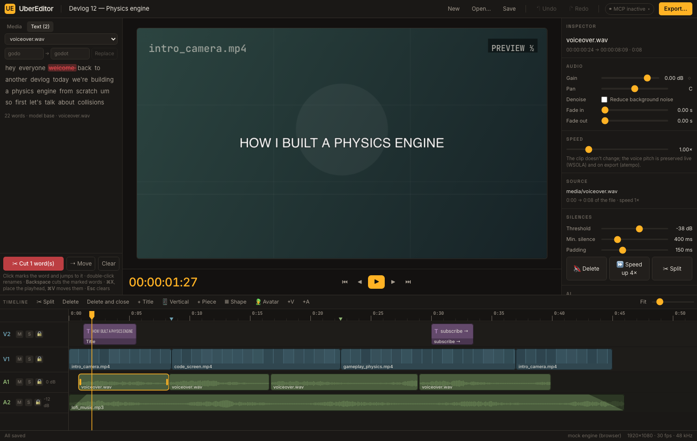
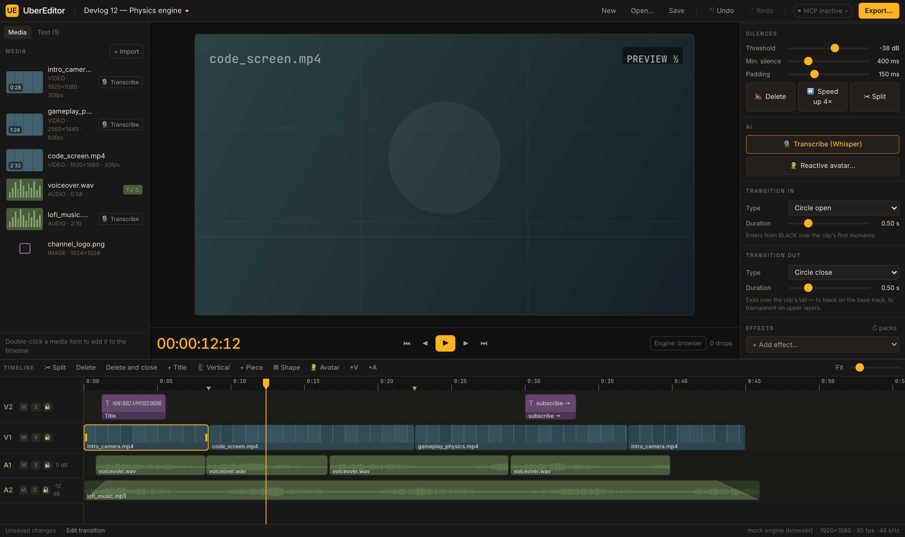
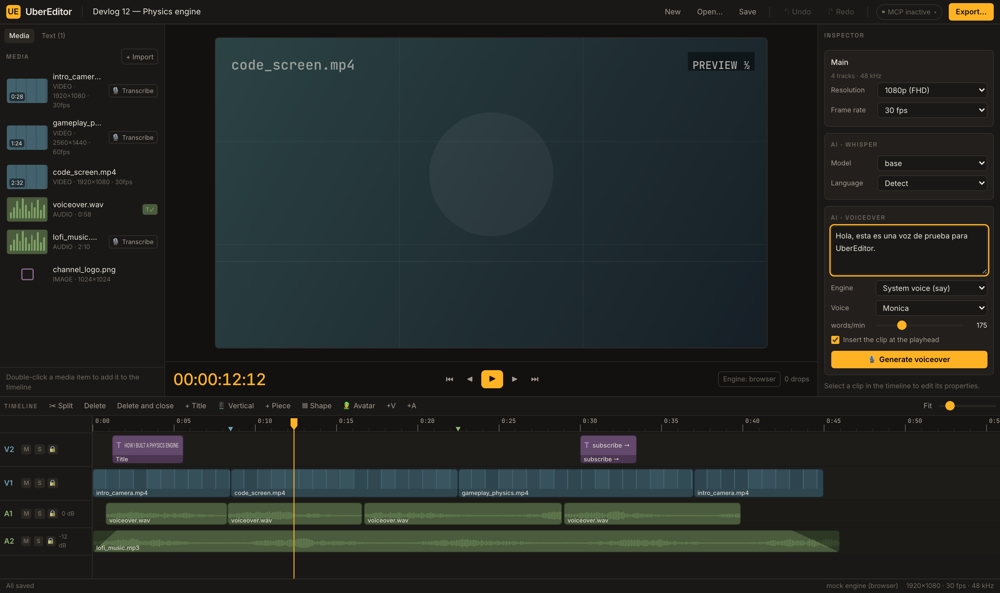
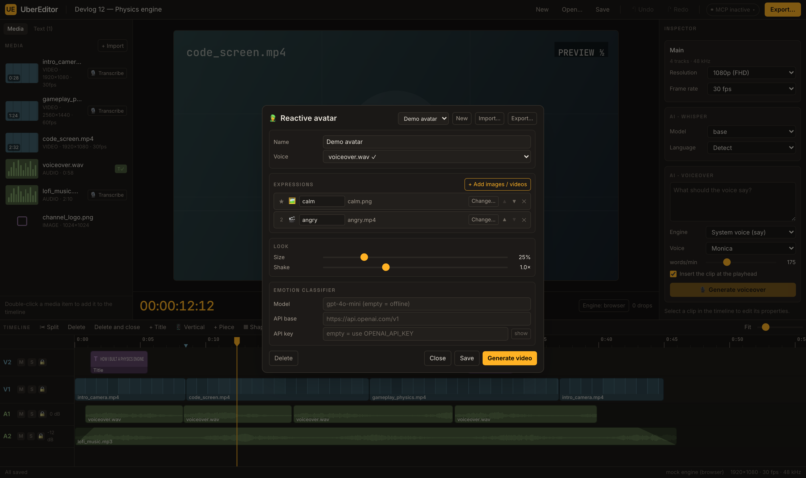

# UberEditor

Cross-platform desktop video editor (Tauri 2 + Rust + React) built for content creators, with AI superpowers: **text-based editing** (word-by-word Whisper), **silences gone with one click**, **automatic verticals**, **emotion-reactive avatar**, **karaoke subtitles**, **voiceover from text**, and an **embedded MCP server** so an agent (Claude, etc.) can edit your project for you.



- Everything is undoable: every operation (including the AI and MCP ones) is **one** undo entry
- Same render engine in preview and export (shared ffmpeg chains): what you see is what you get

---

## Requirements

| What | Version | Notes |
|---|---|---|
| **FFmpeg + FFprobe** | ≥ 6 on the `PATH` | The heart of the render. `brew install ffmpeg` / `apt install ffmpeg`. `UE_FFMPEG` / `UE_FFPROBE` point to specific binaries |
| **Rust** (stable) + **Node** ≥ 20 | — | Only to build |

```bash
npm install
npx tauri dev        # the full desktop app
```

Nothing else to install: the Whisper models download themselves the first time you transcribe, and the Python-based extras (neural denoiser, Kokoro voice) provision their own venv on first use.

---

## Timeline editing

- **Move**: drag a clip; the **magnet** snaps it to other clips' edges, the playhead, 0, the I–O range, and markers (`Alt` disables it).
- **Trim**: drag a clip's **edges** (handles visible when selected).
- **Multi-selection**: drag a **rectangle** over empty area (marquee); `⇧` adds to the selection.
- **Linked clips 🔗**: adding a video with audio creates two clips (video on `V*`, audio on `A*`) that behave as one: split, move, trim, change speed, or delete affects both. `Inspector → Link → Unlink` separates them.
- **Tracks**: `+V` / `+A` add tracks; in the header: `M` mutes, `S` solos, 🔒 locks, **double-click the name** renames, ✕ deletes (undoable), and on audio tracks the **dB is dragged** vertically (double-click → 0 dB).
- **Real multi-layer**: the lowest video track is the base; clips on higher tracks are composited on top (with their position, scale, and opacity) in the export too.
- **Speed**: 0.25×–4×. **The voice's pitch is preserved** both live (WSOLA) and on export (atempo).
- **Zoom**: `⌘`+wheel at the cursor, or `Fit`.

## Keyboard shortcuts

| Key | Action |
|---|---|
| `Space` | Play / pause |
| `J` / `K` / `L` | Shuttle: back / pause / forward (repeat doubles: 1→2→4→8×) |
| `S` (or `⌘K`) | Split the clip under the playhead (linked clips split together) |
| `Del` / `Backspace` | Delete selection · with `⇧` it deletes **and closes the gap** (ripple) |
| `←` / `→` | One frame back/forward · with `⇧` ten frames |
| `Home` | Go to 0 |
| `I` / `O` | Mark in / out of the **work range** (amber band on the ruler) |
| `P` | Save the current I–O range as an **export piece** |
| `⇧X` | Clear the I–O range |
| `⌘Z` / `⌘⇧Z` | Undo / redo |
| `⌘S` / `⌘O` | Save / open project |

In the **Text** tab the keys act on the transcript instead: `Backspace` cuts the marked words, `⌘X` / `⌘V` moves them, `Esc` clears. Every slider's numeric readout is editable: type an exact value, `↑`/`↓` nudges (`⇧` ×10).

## Transform and keyframes

Every clip has **Position X/Y, Opacity, Scale, Rotation** and **flip H/V** (and audio, **Gain**). Next to each slider, `◇` creates a keyframe at the playhead (`◆` = there's one already; click removes it). Once the property is animated, **moving the slider writes a keyframe** at the playhead, like Premiere/Resolve.

The **curve editor** appears below: drag the diamonds (time and value), **double-click** adds or removes keys, and selecting a key picks its interpolation (**linear / hold / smooth**). The diamonds are also drawn on the clip in the timeline.

The animation looks **the same when paused, playing, and in the export** (same curve math on all three paths).

## Effects and generators

`Inspector → Effects → + Add effect`. Five built-ins: **Chroma Key**, **Color correction**, **Gaussian blur**, **Drop shadow** (great on a PiP/overlay to lift it off the background) and **Vertical: blurred background**. All their parameters are keyframable.

**▦ Shape** in the timeline adds a generated clip: a **solid rectangle** or a **gradient**. They're normal clips, so the full transform applies — keyframe a panel that slides in, put a semi-transparent one behind a title.

Effects and generators are **data, not code**: a `manifest.json` (parameters + ffmpeg template) that preview and export both run, so they can't drift apart. You can add your own without rebuilding.
📖 [`docs/PACKS.md`](docs/PACKS.md)

## Text, titles, and templates

- **+ Title** adds text at the playhead (on a free track).
- `Inspector → Text`: content, **system font** (all installed ones), size, color, alignment, position, and line height. Sizes and positions are relative to 1080p, so they scale on export.
- **Templates**: save a named style and apply it to any title later.
- Text is rasterized by our own glyph engine (`ue-text`), so **emoji and CJK render properly** — ffmpeg's `drawtext` has no font fallback and libass has no color-font support.

## Transitions

`Inspector → Transition in` / `Transition out` — **every clip has both**, each with a type and a duration (0.1–2 s).

**11 types**: cross fade, wipe ←/→, slide ←/→/↑, circle open, circle close, dissolve, pixelize, radial. Between two touching clips they run as a real A/B cross-transition; where that isn't possible they degrade to an entrance from black instead of silently disappearing. They also work between clips at different speeds.



---

## AI

### Transcription (Whisper)

**🎙 Transcribe** on a media item, or in `Inspector → AI` → word-by-word transcript (the model downloads itself). `T✓` = already transcribed; click again to **re-transcribe** (subtitle clips keep working). Model and language live in the Inspector with nothing selected (`AI · Whisper`): tiny/base/small/medium/large-v3-turbo · auto/es/en/pt/fr/de.

### Text-based editing

**Text** tab: the full transcript, with the current word highlighted during playback.

- **Click** a word to mark it and jump to it; **`Backspace`** cuts the marked words — removing those pieces of the video **on all tracks** and closing the gaps (1 undo).
- **`⌘X`**, place the playhead, **`⌘V`** — moves a contiguous block of words somewhere else (reorders spoken phrases without touching blades).
- **Double-click** a word to fix what Whisper misheard, or use the **find → replace** bar for every occurrence at once. Audio timing is untouched; only the captions change.

### Silences

`Inspector → Silences` (clip with audio), with sliders for **threshold (dB)**, **minimum duration**, and **margin** around speech:

- **🔇 Delete** — cuts the silences and closes the gaps (all tracks, 1 undo).
- **⏩ Speed up 4×** — instead of deleting, it speeds up the silent stretches.
- **✂ Split** — only cuts at the silence boundaries, so you decide what to delete.

### Automatic subtitles

**💬 Auto subtitles** on a transcribed clip. Three modes in `Inspector → Subtitles`:

- **By phrases** — one line per segment.
- **Word by word** — one big word at a time (shorts style).
- **Karaoke** — the full phrase visible and **each word lights up as it's spoken** (configurable highlight color).

Words per line is automatic or 1–12 by hand; font, size, color, height and line spacing are yours.

### Voiceover from text (TTS)

`AI · Voiceover` in the Inspector (nothing selected): write the script, pick an engine and a voice, and **🎙 Generate voiceover**. The audio is synthesized in the background, lands in the media pool as a normal asset, and can drop itself at the playhead.



Two built-in engines — the **macOS system voice** (`say`: instant, offline, every installed voice) and **Kokoro-82M** (self-contained: the app provisions its own venv on first use). Adding another engine needs **no code**: drop a JSON manifest into the `tts_engines/` folder. 📖 [`docs/TTS.md`](docs/TTS.md)

### Reactive avatar

**🧑‍🎤 Avatar** → add expressions (an image or video per emotion), pick the voice that drives it, set the classifier model/API key, and **Generate video**.



It classifies each phrase into an expression (offline energy/rhythm classifier, or any OpenAI-compatible model if you set a key/`OPENAI_API_KEY`) and renders a **transparent** avatar video that shakes to the volume. The result **lands in the media pool as a normal clip** — place it, scale it, key it or animate it like any other footage:


Avatar setups are saved in the project and can be imported/exported (Youtubers-toolkit `config.json` compatible).

### Automatic vertical (Shorts/Reels)

**📱 Vertical** generates a 1080×1920 twin of the sequence with a blurred background and the video centered. The sequence selector (next to the timeline buttons) switches back to the horizontal one. Each sequence exports separately.

---

## Audio

- **Gain** (animatable with keyframes), **Pan** (balance law), in/out **fades** per clip; per-**track** volume; **RMS L/R meters** during playback.
- Audio is the **master clock**: the position comes from the frames served to the device (no drift).
- **Background noise removal** per clip (`Audio → Reduce background noise`): Facebook's DNS64 neural denoiser, rendered in the background — playback and export switch to the same clean audio when ready. Self-contained: the app provisions its own Python venv on first use.
  📖 [`docs/DENOISE.md`](docs/DENOISE.md)

## Export

- **Presets**: YouTube 1080p, YouTube 4K, Maximum quality, Fast draft, **Audio only (M4A)**, and **GIF**.
- Adjustable: maximum resolution, CRF quality, codec speed, audio bitrate, optional **R128 normalization** (−14 LUFS, YouTube style).
- **Scope**: the whole timeline, the **I–O range**, or **pieces** — mark a range with `I`/`O` and press `P` for each chunk you want, and they render **concatenated into one file**, in order.
- Live progress on the button and a **Cancel** that cleans up the half-written file.

## Projects

- **`.uep`** format (readable JSON), **portable**: media paths are stored relative to the project — move the whole folder to another disk/machine and open it. Media that can't be found stays **offline** (in red) with a **Relink…** button.
- **Autosave**: every minute (if there are changes) a `.uep.autosave` copy is written; if the app dies, on startup it offers to **recover**. A real save invalidates it.
- The caches (conformed audio, proxies, waveforms, thumbnails) live outside the project, indexed by content hash: they regenerate themselves on another machine.

---

## MCP server (agent-based editing)

On startup, the app brings up an MCP server at `http://127.0.0.1:4599/mcp` (loopback only) **protected with a token** (generated at startup; find it in the «MCP» pill in the header, which includes the connection command ready to copy):

```bash
claude mcp add --transport http ubereditor http://127.0.0.1:4599/mcp \
  --header "Authorization: Bearer <token>"
```

**53 tools — everything the UI can do, an agent can do**: import, relink and transcribe media, cut, trim, move and split clips, animate transforms with keyframes, apply effects and transitions, add titles, shapes and subtitles, manage tracks and sequences, remove silences, fix transcription errors, generate voiceovers and the reactive avatar, and render. Parity is enforced by a test: a UI feature with no tool fails the suite on purpose.

Every edit an agent makes is **one** undo entry in the UI, and a call that would break the project fails without changing anything. It can also *see* what the editor is showing (`debug_render_frame`, `playback`), so it can verify a frame or reproduce a visual bug instead of guessing.

📖 **[Full reference: `docs/MCP.md`](docs/MCP.md)** — the rules, a typical session, every tool, background jobs, and how to add one.

---

## Development

```bash
cargo test                    # 182 tests: unit + pixel tests over real ffmpeg exports
cargo clippy --workspace --all-targets

npm run dev                   # UI in the browser with the MOCK engine (http://localhost:5175)
npm run typecheck
npm run screenshot            # 15 visual steps with functional assertions → screenshots/<date>/

npx tauri dev                 # the real app
```

Nine crates (pure model, media, audio, render, text, export, AI, whisper, Tauri shell), one compositor shared by preview and export, microseconds everywhere.
📖 [`docs/ARCHITECTURE.md`](docs/ARCHITECTURE.md)
